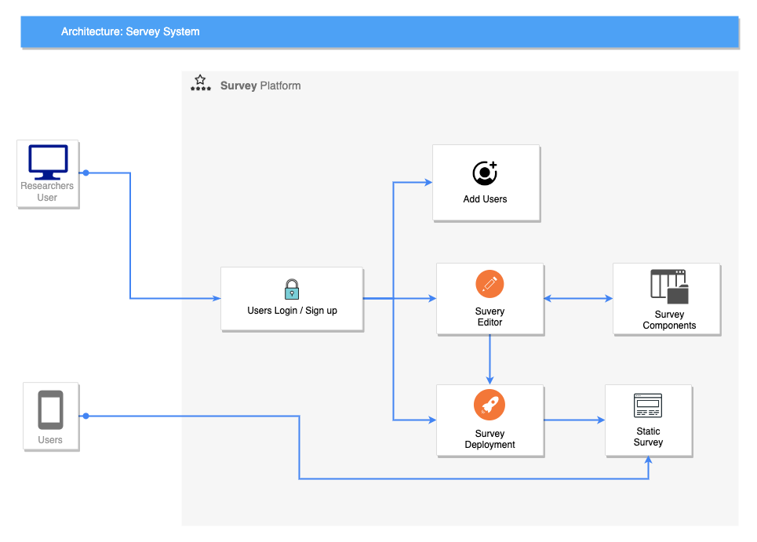

# SimpleSurvey

A simple survey system which enables users to deploy their own survey system including role authentication, survey editor and distribution of survey pages.

Note 2: Make sure you add .env to your .gitignore before pushing any changes to your repository. You will also want to generate new public & private keys

## Get Started

### Database setup

Config `dbUri` in `/config/default.ts` as a valid MongoDB url.

Add env vars to `.env` (create one if doesn't exist) like below: 
```
ACCESS_TOKEN_PUBLIC_KEY="xxx"
ACCESS_TOKEN_PRIVATE_KEY="xxx"
REFRESH_PUBLIC_KEY="xxx"
REFRESH_PRIVATE_KEY="xxx"
```

Launch your MongoDB service which can be connected by your valid MongoDB url.

### Backend

1. Add deps for backend: `yarn`

2. Start: `yarn dev`

### Frontend
> Open another terminal

> enter into the directory for frontend
`cd frontend`

1. Install deps for frontend: `yarn`
2. Update `API_URL` in `frontend/src/constants.tsx` to `http://localhost:8080` for seperately dev/test. It won't set for deployment because in deployment env, we use integrated deployment.
3. Start: `yarn dev`

#### Generate new keys: https://travistidwell.com/jsencrypt/demo/

#### Base64 encode the keys: https://www.base64encode.org/


## Common issues
jwt malformed: before request, you should have a jwt, which means you should create session.

## Deployment on Server
1. Change `API_URL` in `frontend/src/constants.tsx` to '', no cors origin request in deployment
2. `cd frontend && yarn build`
3. `yarn dev` at root directory to test the backend services, if everything is good, the website will be deployed at `localhost:8080`
4. `yarn build` to build backend codes to javascript codes for deployment.
5. Use any deployment tool to deploy this node.js backend service. Such as `pm2 start`


## Deployment Instruction on our AWS EC2 Instance

1. ssh login, your ssh key may not be eligible, update the permission of the SimpleSurvey instance on AWS portal.
2. `sudo -i`, checkout root user
3. `cd ~/SimpleSurvey`, in root directory, there is `SimpleSurvey` directory which is the source code of our project
4. `git pull`: pull the latest code
5. `yarn build:frontend && yarn build`: build frontend code and backend code
6. [Optional] `yarn dev`: run development application for testing everything is ok.
7. `pm2 start`: use `pm2` to launch a server.
8. [Optional] `pm2 list`/`pm2 log`: use `pm2` list and log to check if your serve works well.

## Concepts
* REST API principals
    * CRUD
    * HTTP methods
* JWT & refresh tokens
* Request validation
## Technologies
* Node.js
* MongoDB with Mongoose
* TypeScript
* Express.js & Express.js middleware
* Zod validation

## Architecture


## Survey Simsple Overview



## What will we use
* Docker (image)
* docker-compose (container)
* Caddy - Web server
* DigitalOcean

Note: You will need Docker installed locally if you want to test your Docker configutation


## TODO

Card configuration suggestion: relation with previous summary from clients.
- Filter Key: Diagnosis, device use, control method.

## Project Planning

### Login module:
1. Design and implement user authentication and authorization
2. Create login and registration pages
3. Integrate with a database to store user information
### Survey editor module:
1. Design and implement a user-friendly interface for creating and editing surveys: component panel, preset, configurations
2. Implement logic to handle different types of questions, such as multiple choice, open-ended, etc.
3. Implement logic for ranking and classification components
4. Integrate with the backend to save survey data
### User management module:
#### Admin:
1. Design and implement a user-friendly interface for creating projects and surveys
2. Implement logic to create, edit, and delete projects and surveys
3. Design and implement a user-friendly interface for creating clinicians
4. Implement logic to create, edit, and delete clinicians
5. Implement logic to assign privileges of projects to clinicians
#### Clinician:
1. Design and implement a user-friendly interface for deploying surveys
2. Implement logic to deploy surveys to users
3. Design and implement a user-friendly interface for adding users
4. Implement logic to add, edit, and delete users
5. Implement logic to deliver surveys to users
#### User:
1. Design and implement a user-friendly interface for completing surveys
2. Implement logic to handle ranking and classification components
3. Implement logic to submit completed surveys

### Survey components configuration module:
1. Design and implement a user-friendly interface for configuring survey components
2. Implement logic for configuring components such as the survey header, footer, and branding
3. Integrate with the backend to save component configurations
### Survey deployment and delivery module:
1. Design and implement a user-friendly interface for deploying and delivering surveys
2. Implement logic for deploying surveys to various platforms, such as email, web, or social media
3. Integrate with the backend to save deployment information

## Timeline
Login module: 1 weeks
Survey editor module: 2 weeks
User management module: 1 weeks
Survey components configuration module: 1 weeks
Survey deployment and delivery module: 2 weeks
